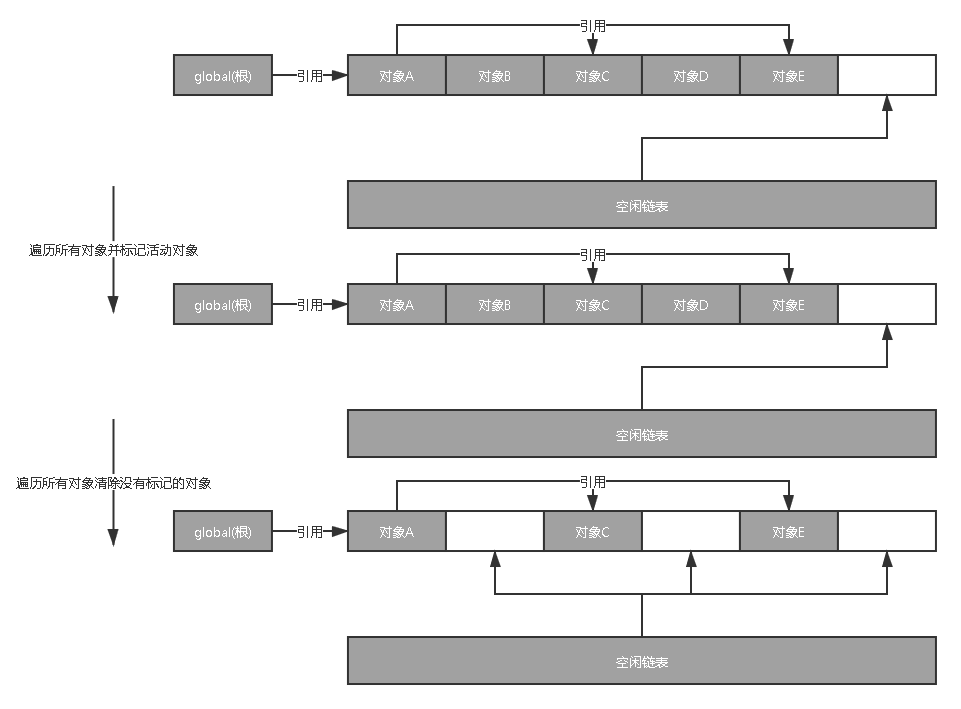
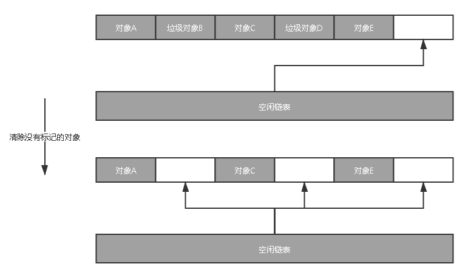
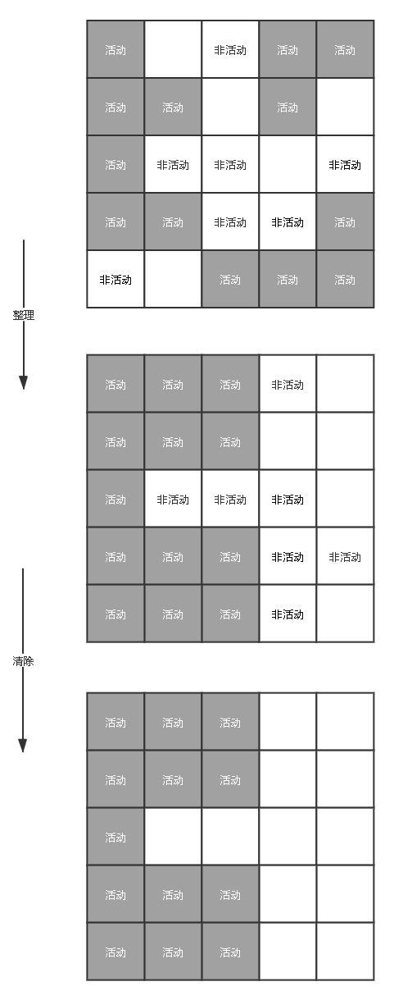

# JavaScript [内存管理](https://developer.mozilla.org/zh-CN/docs/Web/JavaScript/Memory_Management)

## 简介

像 C 语言这样的底层语言一般都有底层的内存管理接口，比如 malloc()和 free()。相反，JavaScript 是在创建变量（对象，字符串等）时自动进行了分配内存，并且在不使用它们时“自动”释放。 释放的过程称为垃圾回收。这个“自动”是混乱的根源，并让 JavaScript（和其他高级语言）开发者错误的感觉他们可以不关心内存管理。

## 内存生命周期

不管什么程序语言，内存生命周期基本是一致的：

- 分配你所需要的内存
- 使用分配到的内存（读、写）
- 不需要时将其释放\归还

所有语言第二部分都是明确的。第一和第三部分在底层语言中是明确的，但在像 JavaScript 这些高级语言中，大部分都是隐含的。

> JavaScript 的内存分配

**值的初始化**

为了不让程序员费心分配内存，JavaScript 在定义变量时就完成了内存分配。

```javascript
const n = 123; // 给数值变量分配内存
const s = 'heath'; // 给字符串分配内存

const o = {
  a: 1,
  b: null,
}; // 给对象及其包含的值分配内存

// 给数组及其包含的值分配内存（就像对象一样）
const a = [1, null, 'abra'];

function f(a) {
  return a + 2;
} // 给函数（可调用的对象）分配内存

// 函数表达式也能分配一个对象
someElement.addEventListener(
  'click',
  function () {
    someElement.style.backgroundColor = 'blue';
  },
  false,
);
```

**通过函数调用分配内存**

有些函数调用结果是分配对象内存：

```javascript
const d = new Date(); // 分配一个 Date 对象

const e = document.createElement('div'); // 分配一个 DOM 元素
```

有些方法分配新变量或者新对象：

```javascript
const s = 'heath';
const s2 = s.substr(0, 3); // s2 是一个新的字符串
// 因为字符串是不变量，
// JavaScript 可能决定不分配内存，
// 只是存储了 [0-3] 的范围。

const a = ['heath heath', 'nan nan'];
const a2 = ['generation', 'nan nan'];
const a3 = a.concat(a2);
// 新数组有四个元素，是 a 连接 a2 的结果
```

> 使用值

使用值的过程实际上是对分配内存进行读取与写入的操作。读取与写入可能是写入一个变量或者一个对象的属性值，甚至传递函数的参数。

> 当内存不再需要使用时释放

大多数内存管理的问题都在这个阶段。在这里最艰难的任务是找到“哪些被分配的内存确实已经不再需要了”。它往往要求开发人员来确定在程序中哪一块内存不再需要并且释放它。

高级语言解释器嵌入了“垃圾回收器”，它的主要工作是跟踪内存的分配和使用，以便当分配的内存不再使用时，自动释放它。这只能是一个近似的过程，因为要知道是否仍然需要某块内存是无法判定的（无法通过某种算法解决）。

## 垃圾回收(Garbage collection)

如上文所述自动寻找是否一些内存“不再需要”的问题是无法判定的。因此，垃圾回收实现只能有限制的解决一般问题。本节将解释必要的概念，了解主要的垃圾回收算法和它们的局限性。

> 引用

垃圾回收算法主要依赖于引用的概念。在内存管理的环境中，一个对象如果有访问另一个对象的权限（隐式或者显式），叫做一个对象引用另一个对象。例如，一个 Javascript 对象具有对它原型的引用（隐式引用）和对它属性的引用（显式引用）。

在这里，“对象”的概念不仅特指 JavaScript 对象，还包括函数作用域（或者全局词法作用域）。

> 可达对象

- 可以访问到的对象就是可达对象（引用、作用域链）
- 可达的标准就是从根出发是否能够被找到
- JavaScript 中的根就是可以理解为是全局变量对象

### 引用计数垃圾收集

这是最初级的垃圾收集算法。此算法把“对象是否不再需要”简化定义为“对象有没有其他对象引用到它”。如果没有引用指向该对象（零引用），对象将被垃圾回收机制回收。

**实现原理**

每个对象在创建的时候，就给这个对象绑定一个计数器。每当有一个引用指向该对象时，计数器加一；每当有一个指向它的引用被删除时，计数器减一。这样，当没有引用指向该对象时，该对象死亡，计数器为 0，这时就应该对这个对象进行垃圾回收操作。

```javascript
let o = {
  a: {
    b: 2,
  },
};
// 两个对象被创建，一个作为另一个的属性被引用，另一个被分配给变量o
// 很显然，没有一个可以被垃圾收集

let o2 = o; // o2变量是第二个对“这个对象”的引用

o = 1; // 现在，“这个对象”只有一个o2变量的引用了，“这个对象”的原始引用o已经没有

let oa = o2.a; // 引用“这个对象”的a属性
// 现在，“这个对象”有两个引用了，一个是o2，一个是oa

o2 = 'yo'; // 虽然最初的对象现在已经是零引用了，可以被垃圾回收了
// 但是它的属性a的对象还在被oa引用，所以还不能回收

oa = null; // a属性的那个对象现在也是零引用了
// 它可以被垃圾回收了
```

**限制：循环引用**

该算法有个限制：无法处理循环引用的事例。在下面的例子中，两个对象被创建，并互相引用，形成了一个循环。它们被调用之后会离开函数作用域，所以它们已经没有用了，可以被回收了。然而，引用计数算法考虑到它们互相都有至少一次引用，所以它们不会被回收。

```javascript
function f() {
  let o = {};
  let o2 = {};
  o.a = o2; // o 引用 o2
  o2.a = o; // o2 引用 o

  return 'heath';
}

f();
```

**实际例子**

IE 6, 7 使用引用计数方式对 DOM 对象进行垃圾回收。该方式常常造成对象被循环引用时内存发生泄漏：

```javascript
let div;
window.onload = function () {
  div = document.getElementById('myDivElement');
  div.circularReference = div;
  div.lotsOfData = new Array(10000).join('*');
};
```

在上面的例子里，myDivElement 这个 DOM 元素里的 circularReference 属性引用了 myDivElement，造成了循环引用。如果该属性没有显示移除或者设为 null，引用计数式垃圾收集器将总是且至少有一个引用，并将一直保持在内存里的 DOM 元素，即使其从 DOM 树中删去了。如果这个 DOM 元素拥有大量的数据 (如上的 lotsOfData 属性)，而这个数据占用的内存将永远不会被释放。

#### 引用计数优缺点

优点

- 发现垃圾时，立即回收
- 最大限度减少程序暂停

缺点

- 无法回收循环引用的对象
- 时间开销大

### 标记-清除算法

这个算法把“对象是否不再需要”简化定义为“对象是否可以获得”。

这个算法假定设置一个叫做根（root）的对象（在 Javascript 里，根是全局对象）。垃圾回收器将定期从根开始，找所有从根开始引用的对象，然后找这些对象引用的对象……从根开始，垃圾回收器将找到所有可以获得的对象和收集所有不能获得的对象。

这个算法比前一个要好，因为“有零引用的对象”总是不可获得的，但是相反却不一定，参考“循环引用”。

从 2012 年起，所有现代浏览器都使用了标记-清除垃圾回收算法。所有对 JavaScript 垃圾回收算法的改进都是基于标记-清除算法的改进，并没有改进标记-清除算法本身和它对“对象是否不再需要”的简化定义。

**实现原理**

- 核心思想：分标记和清除二个阶段完成
- 遍历所有对象并标记活动对象
- 遍历所有对象清除没有标记的对象
- 回收相应的空间



**循环引用不再是问题了**

在上面的示例中，函数调用返回之后，两个对象从全局对象出发无法获取。因此，他们将会被垃圾回收器回收。第二个示例同样，一旦 div 和其事件处理无法从根获取到，他们将会被垃圾回收器回收。

**限制: 那些无法从根对象查询到的对象都将被清除**

尽管这是一个限制，但实践中我们很少会碰到类似的情况，所以开发者不太会去关心垃圾回收机制。

#### 标记-清除算法缺点

> 容易产生内存碎片化空间

- 标记算法并未在清除未标记对象的时候，进行整理，所以在清除标记后，会产生大量的不连续的内存碎片。

- 当分配的内存大于现有连续的内存碎片，则会提前触发新一轮的垃圾回收动作；

- 当分配的内存小于现有连续的内存碎片，则可能会造成浪费。



### 标记整理算法

**实现原理**

- 标记整理可以看做是标记清除的增强
- 标记阶段的操作和标记清除一致
- 清除阶段会先执行整理，移动对象位置


