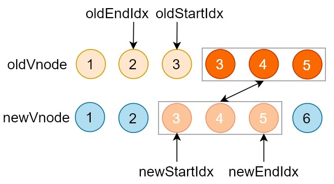

# 作业

## [学习笔记](notes/README.md)

## 题目

### 简答题

1、当我们点击按钮的时候动态给 data 增加的成员是否是响应式数据，如果不是的话，如果把新增成员设置成响应式数据，它的内部原理是什么。

```javascript
let vm = new Vue({
 el: '#el'
 data: {
  o: 'object',
  dog: {}
 },
 method: {
  clickHandler () {
   // 该 name 属性是否是响应式的
   this.dog.name = 'Trump'
  }
 }
})
```

不是响应式数据。

有三种解决方案：

- 初始化时定义

```
data: {
    o: 'object',
    dog: {name: ''}
},
```

内部原理：Vue 中的 Observer 方法，递归遍历对象的所有属性，设置为 getter/setter

- 通过 Vue.set(object, propertyName, value)

```javascript
this.$set(this.dog, 'name', 'Trump');
```

内部原理：调用 set 方法时，通过 defineReactive 方法中的 Object.defineProperty，将新增成员设置为响应式，触发 ob.dep.notify()通知该新增成员的更新。

- Object.assign()

  使用原对象与要混合进去的对象的 property 一起创建一个新的对象

```javascript
this.dog = Object.assign({}, this.dog, { name: 'Trump' });
```

内部原理：如果新赋值的值为对象，则会触发 observe 方法 设置它下面的成员为响应式数据

2、请简述 Diff 算法的执行过程


- 循环结束
  - 当老节点的所有子节点先遍历完 (oldStartIdx > oldEndIdx)，循环结束
  - 新节点的所有子节点先遍历完 (newStartIdx > newEndIdx)，循环结束
- 如果老节点的数组先遍历完(oldStartIdx > oldEndIdx)，说明新节点有剩余，把剩余节点批量插入到右边



- 如果新节点的数组先遍历完(newStartIdx > newEndIdx)，说明老节点有剩余，把剩余节点批量删除


### 编程题

1、模拟 VueRouter 的 hash 模式的实现，实现思路和 History 模式类似，把 URL 中的 # 后面的内容作为路由的地址，可以通过 hashchange 事件监听路由地址的变化。

[答案](./code/question-1)

2、在模拟 Vue.js 响应式源码的基础上实现 v-html 指令，以及 v-on 指令。

[答案](./code/question-2)

3、参考 Snabbdom 提供的电影列表的示例，利用 Snabbdom 实现类似的效果，如图：


[答案](./code/question-3)
