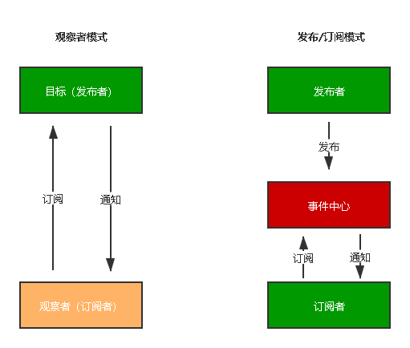
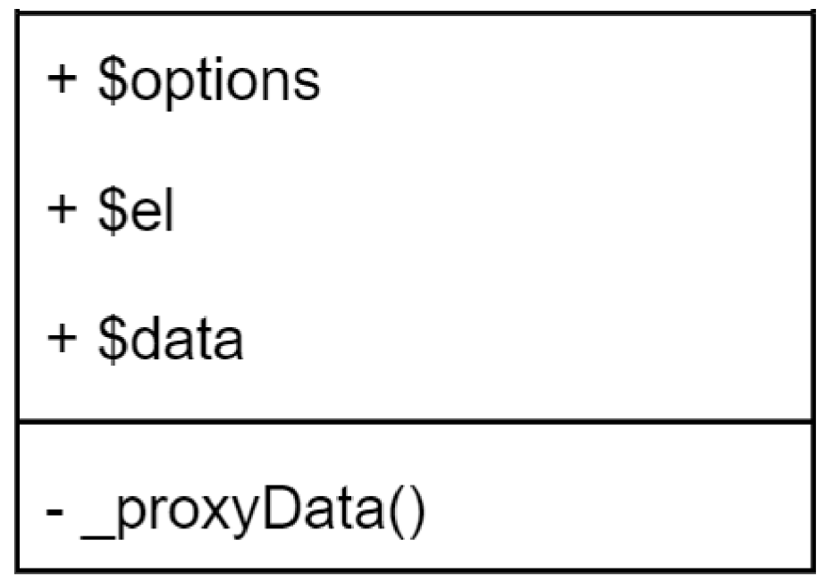
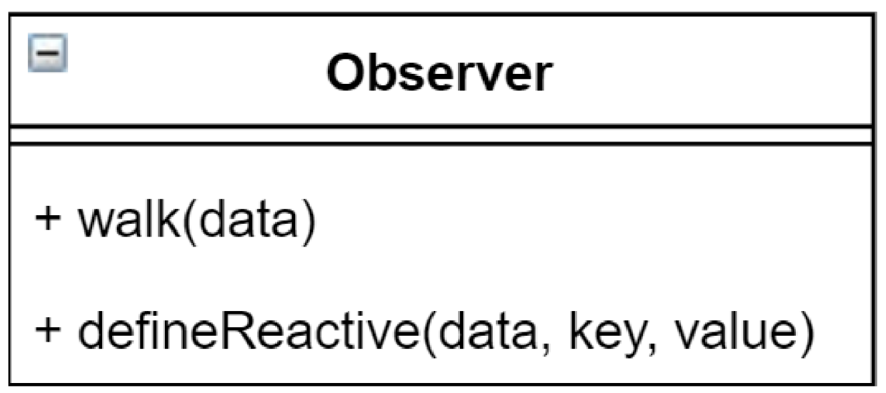
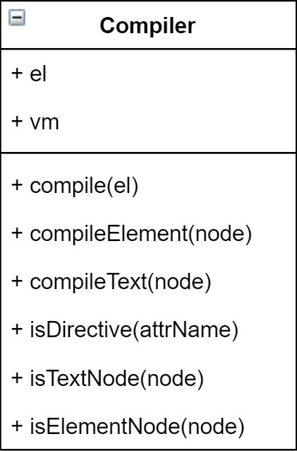
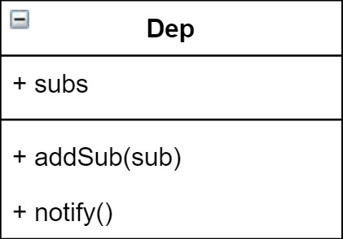
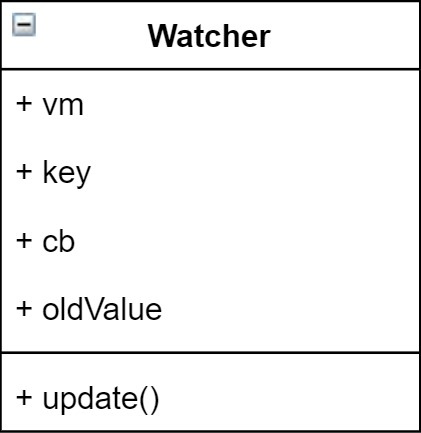
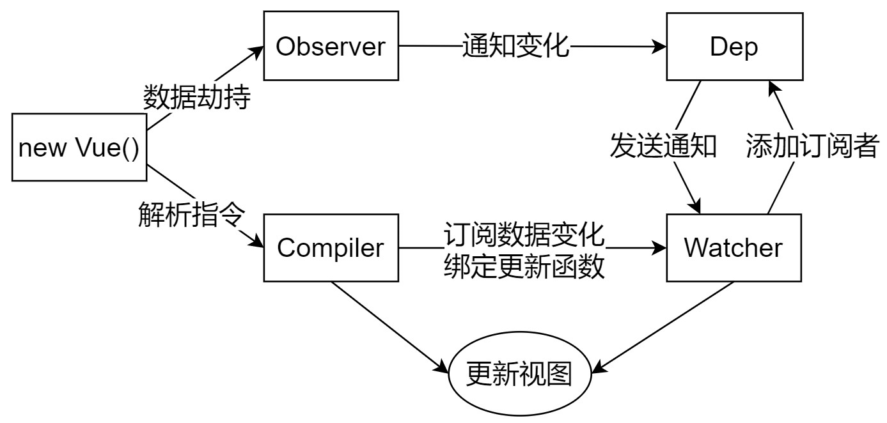

# 深入响应式原理

数据响应式、双向绑定、数据驱动

- 数据响应式

  数据模型仅仅是普通的 JavaScript 对象，而当我们修改数据时，视图会进行更新，避免了繁琐的 DOM 操作，提高开发效率

- 双向绑定

  - 数据改变，视图改变；视图改变，数据也随之改变
  - 我们可以使用 v-model 在表单元素上创建双向数据绑定

- 数据驱动是 Vue 最独特的特性之一

  开发过程中仅需要关注数据本身，不需要关心数据是如何渲染到视图

## [Vue2.x 响应式原理](https://cn.vuejs.org/v2/guide/reactivity.html)

当你把一个普通的 JavaScript 对象传入 Vue 实例作为 data 选项，Vue 将遍历此对象所有的 property，并使用 [Object.defineProperty](https://developer.mozilla.org/zh-CN/docs/Web/JavaScript/Reference/Global_Objects/Object/defineProperty) 把这些 property 全部转为 getter/setter。Object.defineProperty 是 ES5 中一个无法 shim 的特性，这也就是 Vue 不支持 IE8 以及更低版本浏览器的原因。

### 对象单属性数据劫持

- configurable

  当且仅当该属性的 configurable 键值为 true 时，该属性的描述符才能够被改变，同时该属性也能从对应的对象上被删除。

- enumerable

  当且仅当该属性的 enumerable 键值为 true 时，该属性才会出现在对象的枚举属性中。
  默认为 false。

```html
<!DOCTYPE html>
<html lang="en">
  <head>
    <meta charset="UTF-8" />
    <meta
      name="viewport"
      content="width=device-width, user-scalable=no, initial-scale=1.0, maximum-scale=1.0, minimum-scale=1.0"
    />
    <meta http-equiv="X-UA-Compatible" content="ie=edge" />
    <title>Document</title>
  </head>
  <body>
    <script>
      const el = document.createElement('p');
      el.textContent = '在控制台输入vm.msg = 123';
      document.body.append(el);

      // 模拟Vue中的data选项
      let data = { msg: 12 };
      // 模拟vue实例
      let vm = {};
      // 数据劫持：当访问或者设置 vm 中的成员的时候，做一些干预操作
      Object.defineProperty(vm, 'msg', {
        configurable: true,
        enumerable: true,
        // 当获取值的时候执行
        get: () => {
          console.log('获取');
          return data.msg;
        },
        // 当赋值的时候执行
        set: (val) => {
          console.log('赋值msg ==> ', val);
          if (val === data.msg) {
            return;
          }
          data.msg = val;
          // 数据更改，更新 DOM 的值
          document.getElementsByTagName('p')[0].textContent = val;
        },
      });
    </script>
  </body>
</html>
```

### 对象多属性数据劫持

```html
<!DOCTYPE html>
<html lang="en">
  <head>
    <meta charset="UTF-8" />
    <title>Title</title>
  </head>
  <body>
    <script>
      const el = document.createElement('p');
      el.textContent = '1231';
      document.body.append(el);

      let data = {
        msg: '成功',
        code: 1,
      };
      let vm = {};
      Object.keys(data).forEach((key) => {
        Object.defineProperty(vm, key, {
          enumerable: true,
          configurable: true,
          get: () => {
            console.log(`获取 ${key}==>${data[key]}`);
            return data[key];
          },
          set: (val) => {
            if (val === data[key]) {
              return;
            }
            console.log(`赋值 ${key}==>${val}`);
            data[key] = val;
            document.getElementsByTagName('p')[0].textContent = val;
          },
        });
      });
    </script>
  </body>
</html>
```

## vue3.x 响应式原理

- [Proxy](https://developer.mozilla.org/zh-CN/docs/Web/JavaScript/Reference/Global_Objects/Proxy)
- 直接监听对象，而非属性。
- `ES6`中新增，IE 不支持，性能由浏览器优化

```html
<!DOCTYPE html>
<html lang="en">
  <head>
    <meta charset="UTF-8" />
    <title>Title</title>
  </head>
  <body></body>
  <script>
    const el = document.createElement('p');
    el.textContent = '在控制台输入vm.msg = 123';
    document.body.append(el);

    let data = {
      msg: '成功',
      code: 0,
    };
    const vm = new Proxy(data, {
      get(target, key) {
        console.log(`获取${key}===>${target[key]}`);
        return target[key];
      },
      set(target, key, value) {
        if (target[key] === value) return;
        console.log(`设置${key}===>${value}`);
        target[key] = value;
        document.getElementsByTagName('p')[0].textContent = value;
      },
    });
  </script>
</html>
```

## 发布订阅模式和观察者模式

### 发布/订阅模式

- 订阅者
- 发布者
- 信号中心

> 我们假定，存在一个"信号中心"，某个任务执行完成，就向信号中心"发布"（publish）一个信号，其他任务可以向信号中心"订阅"（subscribe）这个信号，从而知道什么时候自己可以开始执行。这就叫做"发布/订阅模式"（publish-subscribe pattern）

### [Vue 的自定义事件](https://cn.vuejs.org/v2/guide/components-custom-events.html)

```javascript
let vm = new Vue();
vm.$on('dataChange', () => {
  console.log('dataChange');
});
vm.$on('dataChange', () => {
  console.log('dataChange1');
});
vm.$emit('dataChange');
```

### 兄弟组件通信过程

```
// eventBus.js
// 事件中心
export let eventHub = new Vue()

// ComponentA.vue
import {eventHub} from './eventBus'
// 发布者
addTodo: function () {
// 发布消息(事件)
eventHub.$emit('add-todo', { text: this.newTodoText })
this.newTodoText = ''
}
// ComponentB.vue
import {eventHub} from './eventBus'
// 订阅者
created: function () {
// 订阅消息(事件)
eventHub.$on('add-todo', this.addTodo)
}
```

### 模拟 Vue 自定义事件的实现

```javascript
/**
 * @author Wuner
 * @date 2020/7/29 21:58
 * @description
 */
class EventEmitter {
  constructor() {
    this.events = {};
  }

  // 订阅通知
  $on(eventType, handle) {
    this.events[eventType] = this.events[eventType] || [];
    this.events[eventType].push(handle);
  }

  // 发布通知
  $emit(eventType) {
    if (this.events[eventType]) {
      this.events[eventType].forEach((handle) => handle());
    }
  }
}

// 测试
let ev = new EventEmitter();
ev.$on('click', () => {
  console.log('click1');
});
ev.$on('click', () => {
  console.log('click2');
});
ev.$on('next', () => {
  console.log('next');
});

ev.$emit('click');
ev.$emit('next');
```

### 观察者模式

- 观察者(订阅者) -- Watcher
  - update()：当事件发生时，具体要做的事情
- 目标(发布者) -- Dep
  - subs 数组：存储所有的观察者
  - addSub()：添加观察者
  - notify()：当事件发生，调用所有观察者的 update() 方法
- 没有事件中心

```javascript
/**
 * @author Wuner
 * @date 2020/7/29 22:45
 * @description
 */
// 目标(发布者)
// Dependency
class Dep {
  constructor() {
    // 存储所有的观察者
    this.subs = [];
  }

  // 添加观察者
  addSub(sub) {
    if (sub && sub.update) {
      this.subs.push(sub);
    }
  }

  // 通知所有观察者
  notify() {
    this.subs.forEach((sub) => sub.update());
  }
}

// 观察者(订阅者)
class Watcher {
  update() {
    console.log('update');
  }
}

// 测试
const watcher = new Watcher();
const dep = new Dep();
dep.addSub(watcher);

dep.notify();
```

### 总结

- 观察者模式是由具体目标调度，比如当事件触发，Dep 就会去调用观察者的方法，所以观察者模式的订阅者与发布者之间是存在依赖的。
- 发布/订阅模式由统一调度中心调用，因此发布者和订阅者不需要知道对方的存在。



## Vue 响应式原理模拟

### 整体分析


- Vue

  把 data 中的成员注入到 Vue 实例，并且把 data 中的成员转成 getter/setter

- Observer（数据劫持）

  能够对数据对象的所有属性进行监听，如有变动可拿到最新值并通知 Dep

- Compiler（解析指令）

  解析每个元素中的指令/插值表达式，并替换成相应的数据

- Dep（订阅者）

  添加观察者(watcher)，当数据变化通知所有观察者

- Watcher（观察者）

  数据变化更新视图

### Vue

- 负责接收初始化的参数(选项)
- 负责把 data 中的属性注入到 Vue 实例，转换成 getter/setter
- 负责调用 observer 监听 data 中所有属性的变化
- 负责调用 compiler 解析指令/插值表达式



```javascript
/**
 * @author Wuner
 * @date 2020/7/29 23:34
 * @description
 */
class Vue {
  constructor(options) {
    // 初始化参数(选项)
    this.$options = options || {};
    this.$data = this.$options.data || {};
    const el = this.$options.el;
    // 判断el是否是字符串，如果是的话，则通过querySelector找到dom节点，否则直接赋值dom
    this.$el = typeof el === 'string' ? document.querySelector(el) : el;
    // 负责把data中的属性，注入到vue实例，并转换为getter和setter
    this._proxyData(this.$data);
    // 调用 observer 监听 data 中所有属性的变化
    new Observer(this.$data);
    // 编译
    new Compiler(this);
  }

  _proxyData(data) {
    // 遍历 data 的所有属性
    Object.keys(data).forEach((key) => {
      Object.defineProperty(this, key, {
        enumerable: true,
        configurable: true,
        get() {
          return data[key];
        },
        set(val) {
          if (val === data[key]) {
            return;
          }
          data[key] = val;
        },
      });
    });
  }
}
```

### Observer

- 负责把 data 选项中的属性转换成响应式数据
- data 中的某个属性也是对象，把该属性转换成响应式数据
- 数据变化发送通知



```javascript
/**
 * @author Wuner
 * @date 2020/7/30 0:12
 * @description
 */
// 负责数据劫持
// 把 $data 中的成员转换成 getter/setter
class Observer {
  constructor(data) {
    this.walk(data);
  }

  walk(data) {
    // 判断数据是否是对象，如果是对象，则遍历对象的所有属性，设置为 getter/setter
    if (data && typeof data === 'object') {
      // 遍历 data 的所有成员
      Object.keys(data).forEach((key) =>
        this.defineReactive(data, key, data[key]),
      );
    }
  }

  // 定义响应式成员
  defineReactive(data, key, val) {
    let dep = new Dep();
    // 如果val是对象，，继续设置它下面的成员为响应式数据
    this.walk(val);
    Object.defineProperty(data, key, {
      enumerable: true,
      configurable: true,
      get: () => {
        // 收集依赖
        Dep.target && dep.addSub(Dep.target);
        // 这里val不能通过data[key]获取，否则会陷入自调用死循环
        return val;
      },
      set: (newVal) => {
        // 这里val不能通过data[key]获取，否则会陷入自调用死循环
        if (newVal === val) return;
        val = newVal;
        // 如果newVal被赋值为对象，则继续设置它下面的成员为响应式数据
        this.walk(newVal);

        // 发送通知
        dep.notify();
      },
    });
  }
}
```

### Compiler

- 负责编译模板，解析指令/插值表达式
- 负责页面的首次渲染
- 当数据变化后重新渲染视图



nodeType

| 常量                             | 值  | 描述                                                                            |
| -------------------------------- | --- | ------------------------------------------------------------------------------- |
| Node.ELEMENT_NODE                | 1   | 一个 元素 节点，例如 <p> 和 <div>。                                             |
| Node.TEXT_NODE                   | 3   | Element 或者 Attr 中实际的 文字                                                 |
| Node.CDATA_SECTION_NODE          | 4   | 一个 CDATASection，例如 <!CDATA[[ … ]]>。                                       |
| Node.PROCESSING_INSTRUCTION_NODE | 7   | 一个用于 XML 文档的 ProcessingInstruction ，例如 <?xml-stylesheet ... ?> 声明。 |
| Node.COMMENT_NODE                | 8   | 一个 Comment 节点。                                                             |
| Node.DOCUMENT_NODE               | 9   | 一个 Document 节点。                                                            |
| Node.DOCUMENT_TYPE_NODE          | 10  | 描述文档类型的 DocumentType 节点。例如 <!DOCTYPE html> 就是用于 HTML5 的。      |
| Node.DOCUMENT_FRAGMENT_NODE      | 11  | 一个 DocumentFragment 节点                                                      |

已弃用的节点类型常量

| 常量                       | 值  | 描述                                                               |
| -------------------------- | --- | ------------------------------------------------------------------ |
| Node.ATTRIBUTE_NODE        | 2   | 元素 的耦合属性 。在 DOM4 规范里 Node 接口将不再实现这个元素属性。 |
| Node.ENTITY_REFERENCE_NODE | 5   | 一个 XML 实体引用节点。 在 DOM4 规范里被移除。                     |
| Node.ENTITY_NODE           | 6   | 一个 XML <!ENTITY ...> 节点。 在 DOM4 规范中被移除。               |
| Node.NOTATION_NODE         | 12  | 一个 XML <!NOTATION ...> 节点。 在 DOM4 规范里被移除.              |

```javascript
/**
 * @author Wuner
 * @date 2020/7/30 2:52
 * @description
 */
// 负责解析指令/插值表达式
class Compiler {
  constructor(vm) {
    this.el = vm.$el;
    this.vm = vm;
    this.compiler(this.el);
  }

  // 编译模板，处理文本节点和元素节点
  compiler(el) {
    // el.childNodes是一个伪数组
    const childNodes = Array.from(el.childNodes);
    childNodes.forEach((node) => {
      // console.dir(node);
      if (this.isTextNode(node)) {
        // 处理文本节点
        this.compilerText(node);
      } else if (this.isElementNode(node)) {
        // 处理元素节点
        this.compilerElement(node);
      }

      // 判断当前节点是否存在子节点，并且子节点个数大于0，需递归调用compile
      if (node.childNodes && node.childNodes.length) {
        this.compiler(node);
      }
    });
  }

  // 编译元素节点，处理指令
  compilerElement(node) {
    // console.dir(node);
    // attributes是一个伪数组
    // 遍历元素节点中的所有属性，找到指令
    Array.from(node.attributes).forEach((attr) => {
      // 获取元素属性的名称
      // 判断当前的属性名称是否是指令
      if (this.isDirective(attr.name)) {
        this.updater(node, attr);
      }
    });
  }

  // 负责更新 DOM
  // 创建 Watcher
  updater(node, attr) {
    // attrName 的形式 v-text v-model
    // 截取属性的名称，获取 text model
    const attrName = attr.name.substr(2);
    // 处理不同的指令
    const fn = this[attrName + 'Updater'];
    // 因为在 textUpdater等中要使用 this
    fn && fn.call(this, node, attr.value);
  }

  // 处理 v-text 指令
  textUpdater(node, key) {
    node.textContent = this.vm[key];
    // 每一个指令中创建一个 watcher，观察数据的变化
    new Watcher(this.vm, key, (newValue) => {
      node.textContent = newValue;
    });
  }

  // 处理 v-model 指令
  modelUpdater(node, key) {
    node.value = this.vm[key];
    // 监听视图的变化
    node.addEventListener('input', () => (this.vm[key] = node.value));
    // 每一个指令中创建一个 watcher，观察数据的变化
    new Watcher(this.vm, key, (newValue) => {
      node.value = newValue;
    });
  }

  // 编译文本节点
  compilerText(node) {
    // console.dir(node);
    let reg = /\{\{(.+?)\}\}/;
    // 获取文本节点的内容
    let textContent = node.textContent;
    if (reg.test(textContent)) {
      // 插值表达式中的值就是我们要的属性名称
      let key = RegExp.$1.trim();
      // 把插值表达式替换成具体的值
      node.textContent = this.vm.$data[key];
      new Watcher(this.vm, key, (newValue) => {
        node.textContent = newValue;
      });
    }
  }

  // 判断是否属性是指令
  isDirective(attrName) {
    return attrName.startsWith('v-');
  }

  // 判断是否是文本节点
  isTextNode(node) {
    return node.nodeType === 3;
  }

  // 判断是否是元素节点
  isElementNode(node) {
    return node.nodeType === 1;
  }
}
```

## Dep(Dependency)


- 收集依赖，添加观察者(watcher)
- 通知所有观察者



```javascript
/**
 * @author Wuner
 * @date 2020/7/30 22:00
 * @description
 */
class Dep {
  constructor() {
    // 存储观察者的数组
    this.subs = [];
  }

  // 添加观察者
  addSub(sub) {
    // 判断是否是观察者
    sub && sub.update && this.subs.push(sub);
  }

  // 通知所有观察者
  notify() {
    this.subs.forEach((sub) => sub.update());
  }
}
```

## Watcher


- 当数据变化触发依赖， dep 通知所有的 Watcher 实例更新视图
- 自身实例化的时候往 dep 对象中添加自己



```javascript
/**
 * @author Wuner
 * @date 2020/7/30 22:17
 * @description
 */
class Watcher {
  constructor(vm, key, callback) {
    this.vm = vm;
    this.key = key;
    // 当数据变化的时候，调用 callback 更新视图
    this.callback = callback;

    // 在 Dep 的静态属性上记录当前 watcher 对象，当访问数据的时候把 watcher 添加到 dep 的 subs 中
    Dep.target = this;
    // 这里通过vm取值时，会调用到observer中的defineReactive中的get方法
    this.oldValue = vm[key];
    // 赋值后，将缓存清空，防止污染
    Dep.target = null;
  }

  update() {
    this.oldValue !== this.vm[this.key] && this.callback(this.vm[this.key]);
  }
}
```

## 总结

### 问题

- 给属性重新赋值成对象，是否是响应式的？

  是响应式

- 给 Vue 实例新增一个成员是否是响应式的？

  不是响应式的。[原因](https://cn.vuejs.org/v2/guide/reactivity.html)

### 整体流程



- Vue
  - 记录传入的选项，设置 $data/$el
  - 把 data 的成员注入到 Vue 实例
  - 负责调用 Observer 实现数据响应式处理（数据劫持）
  - 负责调用 Compiler 编译指令/插值表达式等
- Observer
  - 数据劫持
  - 负责把 data 中的成员转换成 getter/setter
  - 负责把多层属性转换成 getter/setter
  - 如果给属性赋值为新对象，把新对象的成员设置为 getter/setter
  - 添加 Dep 和 Watcher 的依赖关系
  - 数据变化发送通知
- Compiler
  - 负责编译模板，解析指令/插值表达式
  - 负责页面的首次渲染过程
  - 当数据变化后重新渲染
- Dep
  - 收集依赖，添加订阅者(watcher)
  - 通知所有订阅者
- Watcher
  - 自身实例化的时候往 dep 对象中添加自己
  - 当数据变化 dep 通知所有的 Watcher 实例更新视图
