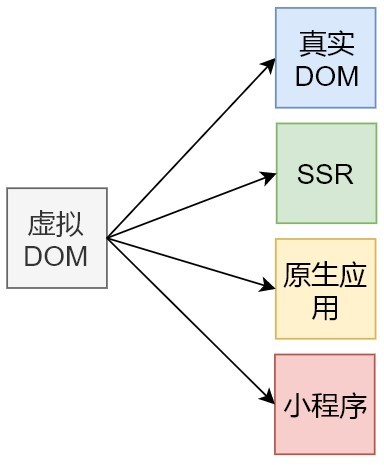

# 虚拟 DOM（Virtual DOM）

## 什么是 Virtual DOM

- Virtual DOM(虚拟 DOM)，是由普通的 JS 对象来描述 DOM 对象，因为不是真实的 DOM 对象，所以叫 Virtual DOM
- 真实 DOM 成员

```
let element = document.querySelector('#app')
let s = ''
for (var key in element) {
s += key + ','
}
console.log(s)
// 打印结果
align,title,lang,translate,dir,hidden,accessKey,draggable,spellcheck,aut
ocapitalize,contentEditable,isContentEditable,inputMode,offsetParent,off
setTop,offsetLeft,offsetWidth,offsetHeight,style,innerText,outerText,onc
opy,oncut,onpaste,onabort,onblur,oncancel,oncanplay,oncanplaythrough,onc
hange,onclick,onclose,oncontextmenu,oncuechange,ondblclick,ondrag,ondrag
end,ondragenter,ondragleave,ondragover,ondragstart,ondrop,ondurationchan
ge,onemptied,onended,onerror,onfocus,oninput,oninvalid,onkeydown,onkeypr
ess,onkeyup,onload,onloadeddata,onloadedmetadata,onloadstart,onmousedown
,onmouseenter,onmouseleave,onmousemove,onmouseout,onmouseover,onmouseup,
onmousewheel,onpause,onplay,onplaying,onprogress,onratechange,onreset,on
resize,onscroll,onseeked,onseeking,onselect,onstalled,onsubmit,onsuspend
,ontimeupdate,ontoggle,onvolumechange,onwaiting,onwheel,onauxclick,ongot
pointercapture,onlostpointercapture,onpointerdown,onpointermove,onpointe
rup,onpointercancel,onpointerover,onpointerout,onpointerenter,onpointerl
eave,onselectstart,onselectionchange,onanimationend,onanimationiteration
,onanimationstart,ontransitionend,dataset,nonce,autofocus,tabIndex,click
,focus,blur,enterKeyHint,onformdata,onpointerrawupdate,attachInternals,n
amespaceURI,prefix,localName,tagName,id,className,classList,slot,part,at
tributes,shadowRoot,assignedSlot,innerHTML,outerHTML,scrollTop,scrollLef
t,scrollWidth,scrollHeight,clientTop,clientLeft,clientWidth,clientHeight
,attributeStyleMap,onbeforecopy,onbeforecut,onbeforepaste,onsearch,eleme
ntTiming,previousElementSibling,nextElementSibling,children,firstElement
Child,lastElementChild,childElementCount,onfullscreenchange,onfullscreen
error,onwebkitfullscreenchange,onwebkitfullscreenerror,setPointerCapture
,releasePointerCapture,hasPointerCapture,hasAttributes,getAttributeNames
,getAttribute,getAttributeNS,setAttribute,setAttributeNS,removeAttribute
,removeAttributeNS,hasAttribute,hasAttributeNS,toggleAttribute,getAttrib
uteNode,getAttributeNodeNS,setAttributeNode,setAttributeNodeNS,removeAtt
ributeNode,closest,matches,webkitMatchesSelector,attachShadow,getElement
sByTagName,getElementsByTagNameNS,getElementsByClassName,insertAdjacentE
lement,insertAdjacentText,insertAdjacentHTML,requestPointerLock,getClien
tRects,getBoundingClientRect,scrollIntoView,scroll,scrollTo,scrollBy,scr
ollIntoViewIfNeeded,animate,computedStyleMap,before,after,replaceWith,re
move,prepend,append,querySelector,querySelectorAll,requestFullscreen,web
kitRequestFullScreen,webkitRequestFullscreen,createShadowRoot,getDestina
tionInsertionPoints,ELEMENT_NODE,ATTRIBUTE_NODE,TEXT_NODE,CDATA_SECTION_
NODE,ENTITY_REFERENCE_NODE,ENTITY_NODE,PROCESSING_INSTRUCTION_NODE,COMME
NT_NODE,DOCUMENT_NODE,DOCUMENT_TYPE_NODE,DOCUMENT_FRAGMENT_NODE,NOTATION
_NODE,DOCUMENT_POSITION_DISCONNECTED,DOCUMENT_POSITION_PRECEDING,DOCUMEN
T_POSITION_FOLLOWING,DOCUMENT_POSITION_CONTAINS,DOCUMENT_POSITION_CONTAI
NED_BY,DOCUMENT_POSITION_IMPLEMENTATION_SPECIFIC,nodeType,nodeName,baseU
RI,isConnected,ownerDocument,parentNode,parentElement,childNodes,firstCh
ild,lastChild,previousSibling,nextSibling,nodeValue,textContent,hasChild
Nodes,getRootNode,normalize,cloneNode,isEqualNode,isSameNode,compareDocu
mentPosition,contains,lookupPrefix,lookupNamespaceURI,isDefaultNamespace
,insertBefore,appendChild,replaceChild,removeChild,addEventListener,remo
veEventListener,dispatchEvent
```

- 可以使用 Virtual DOM 来描述真实 DOM，示例

```json
{
  "sel": "div",
  "data": {},
  "children": undefined,
  "text": "Hello Virtual DOM",
  "elm": undefined,
  "key": undefined
}
```

## 为什么使用 Virtual DOM

- 手动操作 DOM 比较麻烦，还需要考虑浏览器兼容性问题，虽然有 jQuery 等库简化 DOM 操作，但是随着项目的复杂 DOM 操作复杂提升
- 为了简化 DOM 的复杂操作于是出现了各种 MVVM 框架，MVVM 框架解决了视图和状态的同步问题
- 为了简化视图的操作我们可以使用模板引擎，但是模板引擎没有解决跟踪状态变化的问题，于是 Virtual DOM 出现了
- Virtual DOM 的好处是当状态改变时不需要立即更新 DOM，只需要创建一个虚拟树来描述 DOM， Virtual DOM 内部将弄清楚如何有效(diff)的更新 DOM
- 参考 github 上 [virtual-dom](https://github.com/Matt-Esch/virtual-dom) 的描述
  - 虚拟 DOM 可以维护程序的状态，跟踪上一次的状态
  - 通过比较前后两次状态的差异更新真实 DOM

## 虚拟 DOM 的作用

- 维护视图和状态的关系
- 复杂视图情况下提升渲染性能
- 除了渲染 DOM 以外，还可以实现 SSR(Nuxt.js/Next.js)、原生应用(Weex/React Native)、小程序(mpvue/uni-app)等



## Virtual DOM 库

- [Snabbdom](https://github.com/snabbdom/snabbdom)
  - Vue 2.x 内部使用的 Virtual DOM 就是改造的 Snabbdom
  - 大约 200 SLOC（single line of code）
  - 通过模块可扩展
  - 源码使用 TypeScript 开发
  - 最快的 Virtual DOM 之一
- [virtual-dom](https://github.com/Matt-Esch/virtual-dom)

## 案例演示

- [jQuery-demo](https://codesandbox.io/s/jq-demo-5i7qp)
- [snabbdom-demo](https://codesandbox.io/s/snabbdom-demo-4hbyb)
