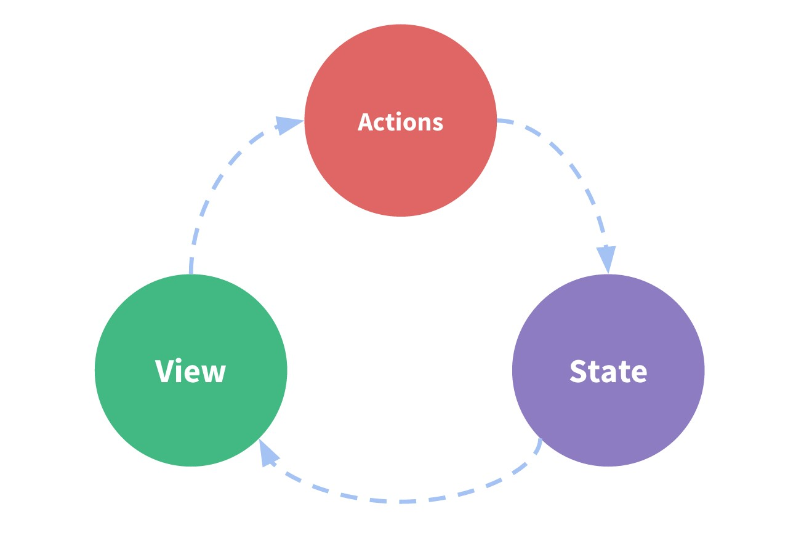
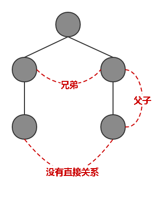

# 状态管理

## 组件内的状态管理流程

Vue 最核心的两个功能：数据驱动和组件化。

组件化开发给我们带来了：

- 更快的开发效率
- 更好的可维护性

每个组件都有自己的状态、视图和行为等组成部分。

```javascript
new Vue({
  // state
  data() {
    return {
      count: 0,
    };
  },
  // view
  template: `
<div>{{ count }}</div>
`,
  // actions
  methods: {
    increment() {
      this.count++;
    },
  },
});
```

状态管理包含以下几部分：

- state，驱动应用的数据源；
- view，以声明方式将 state 映射到视图；
- actions，响应在 view 上的用户输入导致的状态变化。



## 组件间通信方式

大多数场景下的组件都并不是独立存在的，而是相互协作共同构成了一个复杂的业务功能。在 Vue 中为不同的组件关系提供了不同的通信规则。



### [父传子(props)](https://cn.vuejs.org/v2/guide/components.html#%E9%80%9A%E8%BF%87-Prop-%E5%90%91%E5%AD%90%E7%BB%84%E4%BB%B6%E4%BC%A0%E9%80%92%E6%95%B0%E6%8D%AE)

Prop 是你可以在组件上注册的一些自定义 attribute。当一个值传递给一个 prop attribute 的时候，它就变成了那个组件实例的一个 property。为了给博文组件传递一个标题，我们可以用一个 props 选项将其包含在该组件可接受的 prop 列表中：

```javascript
Vue.component('blog-post', {
  props: ['title'],
  template: '<h3>{{ title }}</h3>',
});
```

一个组件默认可以拥有任意数量的 prop，任何值都可以传递给任何 prop。在上述模板中，你会发现我们能够在组件实例中访问这个值，就像访问 data 中的值一样。

一个 prop 被注册之后，你就可以像`这样把数据作为一个自定义 attribute 传递进来：

```html
<blog-post title="My journey with Vue"></blog-post>
<blog-post title="Blogging with Vue"></blog-post>
<blog-post title="Why Vue is so fun"></blog-post>
```

### [子传父(\$emit)](https://cn.vuejs.org/v2/guide/components.html#%E7%9B%91%E5%90%AC%E5%AD%90%E7%BB%84%E4%BB%B6%E4%BA%8B%E4%BB%B6)

有的时候用一个事件来抛出一个特定的值是非常有用的。例如我们可能想让 `<blog-post>` 组件决定它的文本要放大多少。这时可以使用 `$emit` 的第二个参数来提供这个值：

```html
<button v-on:click="$emit('enlarge-text', 0.1)">Enlarge text</button>
```

然后当在父级组件监听这个事件的时候，我们可以通过 \$event 访问到被抛出的这个值：

```html
<blog-post v-on:enlarge-text="postFontSize += $event"></blog-post>
```

或者，如果这个事件处理函数是一个方法：

```html
<blog-post v-on:enlarge-text="onEnlargeText"></blog-post>
```

那么这个值将会作为第一个参数传入这个方法：

```javascript
methods: {
  onEnlargeText: function (enlargeAmount) {
    this.postFontSize += enlargeAmount
  }
}
```

### [非父子组件(Event Bus)](https://cn.vuejs.org/v2/guide/migration.html#dispatch-%E5%92%8C-broadcast-%E6%9B%BF%E6%8D%A2)

通过使用事件中心，允许组件自由交流，无论组件处于组件树的哪一层。由于 Vue 实例实现了一个事件分发接口，你可以通过实例化一个空的 Vue 实例来实现这个目的。

可以通过单独的事件中心管理组件间的通信：

`eventbus.js`

```javascript
// 将在各处使用该事件中心
// 组件通过它来通信
export default new Vue();
```

然后在组件中，可以使用 $emit，$on，\$off 分别来分发、监听、取消监听事件：

```vue
<script>
// NewTodoInput
import eventBus form './eventbus.js'
export default {
  methods: {
    addTodo: function () {
      eventBus.$emit('add-todo', { text: this.newTodoText });
      this.newTodoText = '';
    },
  },
};
</script>
```

```javascript
// DeleteTodoButton
// ...
methods: {
  deleteTodo: function (id) {
    eventHub.$emit('delete-todo', id)
  }
}
```

```javascript
// Todos
// ...
created: function () {
  eventHub.$on('add-todo', this.addTodo)
  eventHub.$on('delete-todo', this.deleteTodo)
},
// 最好在组件销毁前
// 清除事件监听
beforeDestroy: function () {
  eventHub.$off('add-todo', this.addTodo)
  eventHub.$off('delete-todo', this.deleteTodo)
},
methods: {
  addTodo: function (newTodo) {
    this.todos.push(newTodo)
  },
  deleteTodo: function (todoId) {
    this.todos = this.todos.filter(function (todo) {
      return todo.id !== todoId
    })
  }
}
```

## [简单状态管理起步使用](https://cn.vuejs.org/v2/guide/state-management.html)

如果多个组件之间要共享状态(数据)，使用上面的方式虽然可以实现，但是比较麻烦，而且多个组件之间互相传值很难跟踪数据的变化，如果出现问题很难定位问题。

当遇到多个组件需要共享状态的时候，典型的场景：购物车。我们如果使用上述的方案都不合适，我们会遇到以下的问题：

- 多个视图依赖于同一状态。
- 来自不同视图的行为需要变更同一状态。

对于问题一，传参的方法对于多层嵌套的组件将会非常繁琐，并且对于兄弟组件间的状态传递无能为力。

对于问题二，我们经常会采用父子组件直接引用或者通过事件来变更和同步状态的多份拷贝。以上的这些模式非常脆弱，通常会导致无法维护的代码。

因此，我们为什么不把组件的共享状态抽取出来，以一个全局单例模式管理呢？在这种模式下，我们的组件树构成了一个巨大的“视图”，不管在树的哪个位置，任何组件都能获取状态或者触发行为！

我们可以把多个组件的状态，或者整个程序的状态放到一个集中的位置存储，并且可以检测到数据的更改。你可能已经想到了 Vuex。

为了解决这个问题，我们先采用一个简单的 store 模式：

```javascript
var store = {
  debug: true,
  state: {
    message: 'Hello!',
  },
  setMessageAction(newValue) {
    if (this.debug) console.log('setMessageAction triggered with', newValue);
    this.state.message = newValue;
  },
  clearMessageAction() {
    if (this.debug) console.log('clearMessageAction triggered');
    this.state.message = '';
  },
};
```

需要注意，所有 store 中 state 的变更，都放置在 store 自身的 action 中去管理。这种集中式状态管理能够被更容易地理解哪种类型的变更将会发生，以及它们是如何被触发。当错误出现时，我们现在也会有一个 log 记录 bug 之前发生了什么。

此外，每个实例/组件仍然可以拥有和管理自己的私有状态：

```javascript
var vmA = new Vue({
  data: {
    privateState: {},
    sharedState: store.state,
  },
});

var vmB = new Vue({
  data: {
    privateState: {},
    sharedState: store.state,
  },
});
```


:::danger
重要的是，注意你不应该在 action 中 替换原始的状态对象 - 组件和 store 需要引用同一个共享对象，变更才能够被观察到。
:::

接着我们继续延伸约定，组件不允许直接变更属于 store 实例的 state，而应执行 action 来分发 (dispatch) 事件通知 store 去改变，我们最终达成了 Flux 架构。这样约定的好处是，我们能够记录所有 store 中发生的 state 变更，同时实现能做到记录变更、保存状态快照、历史回滚/时光旅行的先进的调试工具。
