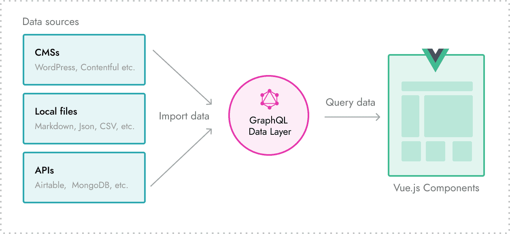
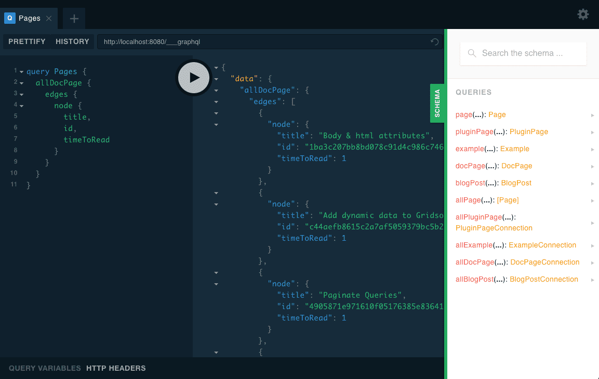

# 处理数据

其实这里 GraphQL 并不是作为服务器端部署，而是作为 Gridsome 在本地管理资源的一种方式。

通过 GraphQL 统一管理实际上非常方便，因为作为一个数据库查询语言，它有非常完备的查询语句，与 JSON 相似的描述结构，再结合 Relay 的 Connections 方式处理集合，管理资源不再需要自行引入其它项目，大大减轻了维护难度。

## GraphQL 数据层

GraphQL 数据层是在开发模式下可用的工具。这是临时存储到 Gridsome 项目中的所有数据的地方。可以将其视为可帮助您更快更好地处理数据的本地数据库。

来自 GraphQL 数据层的数据将生成为静态内容。

数据层和导入数据的源之间没有实时连接。这意味着您需要重新生成网站以获取最新的数据更新。

如果需要动态数据，则应使用[客户端数据](https://gridsome.org/docs/client-side-data/)。

> 提示：默认情况下，Pages 也 Site metadata 已添加到数据层。

### 处理数据

- [如何导入数据](./w-001-importing-data)
- [如何查询数据](./w-002-querying-data)
- [如何过滤数据](./w-003-filtering-data)
- [如何创建分类页面](./w-004-taxonomy-pages)
- [如何分页数据](./w-005-paginate-data)
- [如何添加客户端/动态数据](./w-007-client-side-data)

### GraphQL 资源管理器

每个 Gridsome 项目都有一个 GraphQL 资源管理器，可以在开发模式下使用它来探索和测试查询。

在这里，您还将获得所有可用 GraphQL 集合的列表。

通常可以通过转到 `http:// localhost:8080/___explore` 来打开它。

