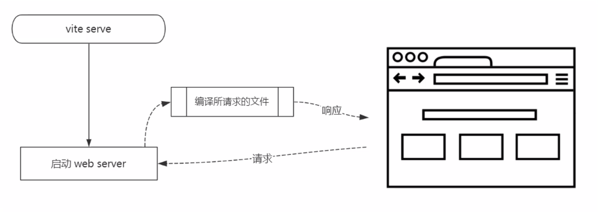

# Vite

## 概念

- Vite 是一个面向现代浏览器的一个更轻、更快的 Web 应用开发工具
- 它基于 ECMAScript 标准的原生模块系统（ES Modules）实现

## 目的

- 它的出现是为了解决 webpack 在开发阶段使用 webpack-dev-server 冷启动时间过长，以及 webpack HMR 热更新反应速度慢的问题。
- 使用 Vite 创建的项目，就是一个普通的 Vue 3 的应用。项目基于 Vue CLI 创建的项目少了很多的配置文件和依赖。

## 项目依赖

- Vite
  - 目前只支持 `Vue 3.x` 版本，创建项目是通过指定不同的模板，也可以使用不同的框架
- @vue/compiler-sfc 编译 `.vue` 单文件组件
  - `Vue 2.x` 中使用的是 `vue-template-compiler`

## 开箱即用

Vite 创建的项目几乎不需要额外的配置。

- `TypeScript` - 内置支持
- `css` 的与编译器 - 内置支持（需要单独安装对应的编译器）
- `less/sass/stylus/postcss`
- `JSX`
- `Web Assembly`

## 特性

`Vite` 带来的优势主要体现在开发者在开发过程中的体验。

- 按需编译
  - 所需的文件按需编译，避免编译用不到的文件，也没有将模块打包到一起的过程。
- 快速冷启动
  - 基于浏览器原生 `ES imports`，直接使用 `<script type="module">` 加载入口文件，不需要等待模块打包的过程，可以立即启动。
- 模块热更新
  - 几乎是实时的，由于模块不是打包到一起的，并且是基于 `ES imports` 按需编译的，所以只需要更新修改的模块即可。
- 开箱即用
  - 避免各种 `loader` 和 `plugin` 的配置。

## HMR

Vite 的热更新原理和 webpack-dev-server 一样，都是使用了 WebSocket（即时通讯）在本地服务端和客户端建立双向通信。

在服务端监听文件变化，一旦文件发生变化，通过 WebSocket 发送给客户端。

客户端通过 WebSocket 监听了一些更新的类型。

当接收到服务端 WebSocket 推送过来的数据，就会像事件一样触发，更新对应的资源。

## 基础使用

```shell
# 启动开发 Web 服务器
vite or vite serve
```

```shell
# 打包
vite build
```

## Vite 和 vue-cli-service 对比

- vue-cli-service
  - 像 webpack 这类工具的做法是将所有的模块提前编译，打包进 bundle 里。
  - 也就是，不管模块是否被执行、使用，都要被编译打包到 bundle 里。
  - 随着项目越来越大，打包后的 bundle 也越来越大，打包的速度自然越来越慢。
- Vite
  - Vite 利用现代浏览器原生支持的 ES Module 模块化的特性，省略了对模块的打包。
  - 对于需要编译的文件，比如单文件组件、样式模块等，Vite 采用另一种模式 - 即时编译。
  - 即具体请求某个文件的时候，才会在服务端编译这个文件。
  - 这种即时编译的好处，主要体现在按需编译，速度会更快。

### Vite

- `Vite` 在运行 `vite serve` 的时候不需要打包，直接开启一个 `web` 服务器。
- 当浏览器请求服务器，例如请求一个单文件组件，这个时候在服务器端编译单文件组件，然后把编译的结果返回给浏览器。
- 模块的处理和编译是在服务器端。



### vue-cli-service

- `Vue Cli` 在运行 `vue-cli-service serve` 的时候，内部会使用 `webpack` 首先打包所有的模块，如果模块非常多，将导致打包速度非常慢。
- 把打包的结果存储到内存中，然后才会开启开发的 web 服务器。
- 浏览器请求 `web` 服务器，把内存中打包的结果直接返回给浏览器。


## HMR 对比

- `Vite HMR`
  - 只需立即编译当前所修改的文件
- `Webpack HMR`
  - 修改某个文件后，会自动以这个文件为入口重新 `build` 一次，所有涉及到的依赖也都会被重新加载一遍

所以 `Vite HMR` 相比 `Webpack HMR` 性能更好一些。

## 打包 build

`Vite` 在生产模式下打包需要使用 `vite build` 命令。

该命令内部使用 `Rollup` 进行打包。

最终还是会把文件都提前编译并打包到一起。

对于代码切割的需求，`Vite` 内部采用的是原生的**动态导入（`Dynamic import`）**的特性实现的，所以打包结果只能支持现代浏览器。

不过动态导入特性是有相应的 `Polyfill` 的。

## 打包 or 不打包

随着 Vite 的出现，引发了另外一个值得开发者思考的问题：究竟有没有必要打包应用？

以前，使用 Webpack 打包会把所有的模块打包到 bundle 里，这样打包的原因主要有两个：

- 浏览器环境并不支持模块化
  - 随着现代浏览器对 ES 标准支持的逐渐完善，这个问题已经慢慢不存在了。
  - 现阶段绝大多数浏览器都支持 ES Module 特性。
- 零散的模块文件会产生大量的 HTTP 请求
  - HTTP 2 多路复用的特性，减少了网络请求次数。

### 浏览器对 ES Module 的支持

- 除了 IE 的现代浏览器基本都支持 ES Module。
- 如果项目需要兼容 IE，需要使用以前的打包方式。


