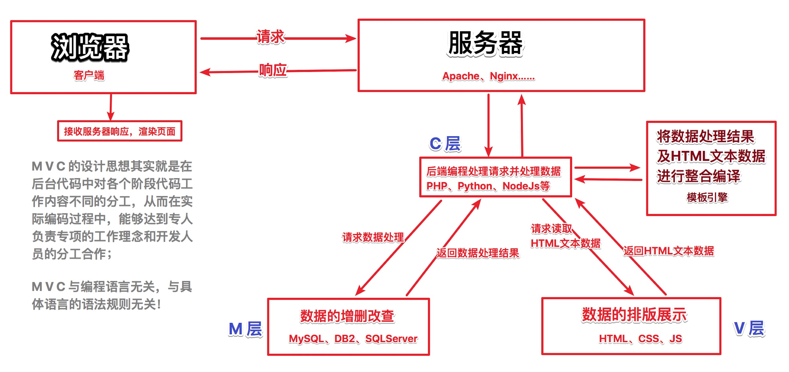
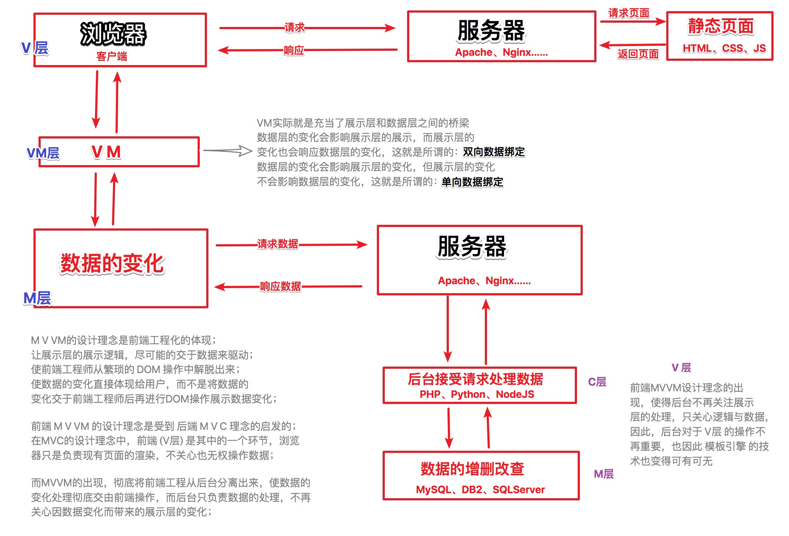
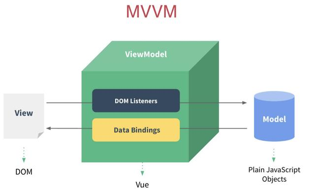

# Vue 面试题

## 面试的套路

其实套路也很简单，但一定不是那种挤牙膏的蹦出来一个两个，这种方式最多只能说明你知道，并不能很好的表现自己的实力

还是刚刚说的，要搞明白套路，你们要想想作为面试官，出一个题的目的是什么

一定要把每一个题看作是一个话题，而不单单只是一问一答，要学会「借题发挥」

套路就是：

1. 先说这个点的明确定义，或者是特性

2. 再说具体的应用场景

   1. 最好能够有具体的场景
   2. 这一点很重要，因为这表示你不仅知道，还有具体经验
   3. 最好还能可以举一些踩坑的例子
   4. 因为开发行业不是看你读了多少书，更多的是得看你踩了多少坑

3. 说说自己的看法、观点

   1. 你也可以装逼一点的说：关于这个问题，我的最佳实践是 xxx
   2. 这一点尤为重要。
   3. 因为这样，你才是一个有「灵魂」的开发

4. 可以稍微举一反三，说说同类特性，或者类似的框架，更好的方案

好了好了，总结一下：

1. 先说这个点的明确定义，或者是特性
2. 再说具体的应用场景，最好能够有具体的场景举例，特别可以举一些踩坑的例子
3. 说说自己的看法、观点、最佳实践
4. 可以稍微举一反三，说说同类特性，或者类似的框架，更好的方案 如果你确实不知道的问题，你倒是可以以请教的态度，让他跟你分享一下
5. 态度很重要！

## 谈一谈你对 MVVM 的理解

服务端处理用户的请求。

```
读取数据
获取模板
把数据 + 模板拼接到一起
发送给用户端
```

### 传统的服务端 MVC 架构模型：



> 核心理念：单一职责，分工协作
>
> 优点：
>
> - 更好的开发效率
> - 更好的可维护性

### MVVM 模型：数据驱动视图

- 前端开发早期的时候都是操作 DOM，稍微好一点的使用 jQuery
- 把繁琐的 DOM 操作更进一步的封装起来了，让你使用一种修改普通数据的方式来修改页面
  - this.message = 123



### Vue 中的 MVVM：



> Vue 中的 MVVM 模式

```html
View 视图层
<template>
  <div>
    <h1>{{ message }}</h1>
    <ul>
      <li v-for="item in list" :key="item.id">{{ item.title }}</li>
    </ul>
  </div>
</template>

<script>
  // Model 层
  // ViewModel 层，就是 Vue 本身
  export default {
    data() {
      return {
        message: 'hello',
        list: [],
      };
    },

    created() {
      // ajax(xxx)
    },
  };
</script>

<style></style>
```

MVVM 模式让我们从繁琐的 DOM 操作中彻底解放了。

## 请说一下响应式数据的原理

Vue 最独特的特性之一，是其非侵入性的响应式系统。数据模型仅仅是普通的 JavaScript 对象。而当你修改它们时，视图会进行更新。这使得状态管理非常简单直接，不过理解其工作原理同样重要，这样你可以避开一些常见的问题。

当你把一个普通的 JavaScript 对象传入 Vue 实例作为 `data` 选项，Vue 将遍历此对象所有的 property，并使用 [Object.defineProperty](https://developer.mozilla.org/zh-CN/docs/Web/JavaScript/Reference/Global_Objects/Object/defineProperty) 把这些 property 全部转为 [getter/setter](https://developer.mozilla.org/zh-CN/docs/Web/JavaScript/Guide/Working_with_Objects#定义_getters_与_setters) 。`Object.defineProperty` 是 ES5 中一个无法 shim 的特性，这也就是 Vue 不支持 IE8 以及更低版本浏览器的原因。

这些 getter/setter 对用户来说是不可见的，但是在内部它们让 Vue 能够追踪依赖，在 property 被访问和修改时通知变更。这里需要注意的是不同浏览器在控制台打印数据对象时对 getter/setter 的格式化并不同，所以建议安装 [vue-devtools](https://github.com/vuejs/vue-devtools) 来获取对检查数据更加友好的用户界面。

每个组件实例都对应一个 **watcher** 实例，它会在组件渲染的过程中把“接触”过的数据 property 记录为依赖。之后当依赖项的 setter 触发时，会通知 watcher，从而使它关联的组件重新渲染。


## Vue 中如何实现监测数组变化

Vue 将被侦听的数组的变更方法进行了包裹，所以它们也将会触发视图更新。这些被包裹过的方法包括：

- `push()`
- `pop()`
- `shift()`
- `unshift()`
- `splice()`
- `sort()`
- `reverse()`

* 使用函数劫持的方式，重写了数组的方法
* Vue 将 data 中的数组，进行了原型链重写。指向了自己定义的数组原型方法，这样当调用数组 API 的时候，可以通知依赖更新。如果数组中包含着引用类型。会对数组中的引用类型再次进行监控拦截处理

总结一下：

- 更新了导致数组变化的原型方法
- 对数组中的每一项进行了数据观测

## 组件的 data 为什么是函数

防止组件重用的时候导致数据相互影响。

```js
export default {
  data: {
    a: 1,
    b: 2
  }
}

组件a：data
组件b：data

export default {
  data () {
    return {
      a: 1,
      b: 2
    }
  }
}

组件a: data()
组件b: data()

function data () {
  return {
    a: 1,
    b: 2
  }
}

const data1 = data()
const data2 = data()

data1 === data2
```

## Vue 中事件绑定原理

```js
vm.$on('事件名称', 处理函数);

vm.$emit('事件名称', 可选参数);
```

## 为什么 Vue 采用异步渲染

因为如何不采用异步渲染，那么每次更新数据都会对当前组件进行重新渲染，所以为了性能考虑，Vue 会在本轮数据更新后，再去异步更新视图。

Vue 是组件级更新，当组件中的数据变化就会更新组件。

```js
this.a = 1;
this.b = 2;

// 数据修改之后立即操作 DOM，拿到的是旧的
```

组件中的数据绑定的都是同一个 watcher，Vue 可以把相同的 watcher 更新过滤掉。所以这是为了提高性能的一个考虑。

## Vue 中 nextTick 的实现原理

在下次 DOM 更新循环结束之后执行延迟回调。在修改数据之后立即使用这个方法，获取更新后的 DOM。

```js
// 修改数据
vm.msg = 'Hello';
// DOM 还没有更新
Vue.nextTick(function () {
  // DOM 更新了
});

// 作为一个 Promise 使用 (2.1.0 起新增，详见接下来的提示)
Vue.nextTick().then(function () {
  // DOM 更新了
});
```

> 2.1.0 起新增：如果没有提供回调且在支持 Promise 的环境中，则返回一个 Promise。请注意 Vue 不自带 Promise 的 polyfill，所以如果你的目标浏览器不原生支持 Promise (IE：你们都看我干嘛)，你得自己提供 polyfill。

可能你还没有注意到，Vue 在更新 DOM 时是**异步**执行的。只要侦听到数据变化，Vue 将开启一个队列，并缓冲在同一事件循环中发生的所有数据变更。如果同一个 watcher 被多次触发，只会被推入到队列中一次。这种在缓冲时去除重复数据对于避免不必要的计算和 DOM 操作是非常重要的。然后，在下一个的事件循环“tick”中，Vue 刷新队列并执行实际 (已去重的) 工作。Vue 在内部对异步队列尝试使用原生的 `Promise.then`、`MutationObserver` 和 `setImmediate`，如果执行环境不支持，则会采用 `setTimeout(fn, 0)` 代替。

例如，当你设置 `vm.someData = 'new value'`，该组件不会立即重新渲染。当刷新队列时，组件会在下一个事件循环“tick”中更新。多数情况我们不需要关心这个过程，但是如果你想基于更新后的 DOM 状态来做点什么，这就可能会有些棘手。虽然 Vue.js 通常鼓励开发人员使用“数据驱动”的方式思考，避免直接接触 DOM，但是有时我们必须要这么做。为了在数据变化之后等待 Vue 完成更新 DOM，可以在数据变化之后立即使用 `Vue.nextTick(callback)`。这样回调函数将在 DOM 更新完成后被调用。例如：

```html
<div id="example">{{message}}</div>
```

```js
var vm = new Vue({
  el: '#example',
  data: {
    message: '123',
  },
});
vm.message = 'new message'; // 更改数据
vm.$el.textContent === 'new message'; // false
Vue.nextTick(function () {
  vm.$el.textContent === 'new message'; // true
});
```

在组件内使用 `vm.$nextTick()` 实例方法特别方便，因为它不需要全局 `Vue`，并且回调函数中的 `this` 将自动绑定到当前的 Vue 实例上：

```js
Vue.component('example', {
  template: '<span>{{ message }}</span>',
  data: function () {
    return {
      message: '未更新',
    };
  },
  methods: {
    updateMessage: function () {
      this.message = '已更新';
      console.log(this.$el.textContent); // => '未更新'
      this.$nextTick(function () {
        console.log(this.$el.textContent); // => '已更新'
      });
    },
  },
});
```

因为 `$nextTick()` 返回一个 `Promise` 对象，所以你可以使用新的 [ES2017 async/await](https://developer.mozilla.org/zh-CN/docs/Web/JavaScript/Reference/Statements/async_function) 语法完成相同的事情：

```js
methods: {
  updateMessage: async function () {
    this.message = '已更新'
    console.log(this.$el.textContent) // => '未更新'
    await this.$nextTick()
    console.log(this.$el.textContent) // => '已更新'
  }
}
```

总结：

nextTick 方法主要是使用了宏任务和微任务，定义了一个异步方法，多次调用 nextTick 方法会将方法存入队列中，通过这个异步方法清空当前队列。所以这个 nextTick 方法就是异步方法。

## computed 和 watch 的区别

- computed 是属性
  - 当你需要根据已有数据产生一些派生数据的时候， 可以使用计算属性
  - 注意：计算属性不支持异步操作，因为计算属性一般要绑定到模板中
  - 更重要的一点是：计算属性会缓存调用的结果，提高性能
  - 计算属性都必须有返回值，没有返回值就没有意义
- watch 是一个功能
  - watch 不需要返回值，根据某个数据变化执行 xxx 逻辑
  - watch 可以执行异步操作

## Vue 组件的生命周期

CMUD：

- create
  - beforeCreate
  - created
- mount
  - beforeMount
  - mounted
- update
  - beforeUpdate
  - updated
- destroy
  - beforeDestroy
  - destroyed

什么情况下被调用，以及相关的应用场景。


- beforeCreate
  - 在实例初始化之后，数据观测 (data observer) 和 event/watcher 事件配置之前被调用。
- created
  - 在实例创建完成后被立即调用。在这一步，实例已完成以下的配置：数据观测 (data observer)，property 和方法的运算，watch/event 事件回调。然而，挂载阶段还没开始，`$el` property 目前尚不可用。
- beforeMount
  - 在挂载开始之前被调用：相关的 `render` 函数首次被调用。
- mounted
  - 实例被挂载后调用，这时 `el` 被新创建的 `vm.$el` 替换了。如果根实例挂载到了一个文档内的元素上，当 `mounted` 被调用时 `vm.$el` 也在文档内。
  - 注意 `mounted` **不会**保证所有的子组件也都一起被挂载。如果你希望等到整个视图都渲染完毕，可以在 `mounted` 内部使用 [vm.\$nextTick](https://cn.vuejs.org/v2/api/#vm-nextTick)：
- beforeUpdate
  - 数据更新时调用，发生在虚拟 DOM 打补丁之前。这里适合在更新之前访问现有的 DOM，比如手动移除已添加的事件监听器。
- updated

  - 由于数据更改导致的虚拟 DOM 重新渲染和打补丁，在这之后会调用该钩子。
  - 当这个钩子被调用时，组件 DOM 已经更新，所以你现在可以执行依赖于 DOM 的操作。然而在大多数情况下，你应该避免在此期间更改状态。如果要相应状态改变，通常最好使用 [计算属性](https://cn.vuejs.org/v2/api/#computed) 或 [watcher](https://cn.vuejs.org/v2/api/#watch) 取而代之。
  - 注意 `updated` **不会**保证所有的子组件也都一起被重绘。如果你希望等到整个视图都重绘完毕，可以在 `updated` 里使用 [vm.\$nextTick](https://cn.vuejs.org/v2/api/#vm-nextTick) :

- activated
  - 被 keep-alive 缓存的组件激活时调用。
- deactivated
  - 被 keep-alive 缓存的组件停用时调用。
- beforeDestroy
  - 实例销毁之前调用。在这一步，实例仍然完全可用。
- destroyed
  - 实例销毁后调用。该钩子被调用后，对应 Vue 实例的所有指令都被解绑，所有的事件监听器被移除，所有的子实例也都被销毁。
- errorCaptured
  - 当捕获一个来自子孙组件的错误时被调用。此钩子会收到三个参数：错误对象、发生错误的组件实例以及一个包含错误来源信息的字符串。此钩子可以返回 `false` 以阻止该错误继续向上传播。
  - 你可以在此钩子中修改组件的状态。因此在捕获错误时，在模板或渲染函数中有一个条件判断来绕过其它内容就很重要；不然该组件可能会进入一个无限的渲染循环。

## v-if 和 v-show 的区别

`v-if` 是“真正”的条件渲染，因为它会确保在切换过程中条件块内的事件监听器和子组件适当地被销毁和重建。

- true：渲染
- false：销毁不渲染，元素就不存在了

`v-if` 也是**惰性的**：如果在初始渲染时条件为假，则什么也不做——直到条件第一次变为真时，才会开始渲染条件块。

相比之下，`v-show` 就简单得多——不管初始条件是什么，元素总是会被渲染，并且只是简单地基于 CSS 进行切换。

- true：display: block
- false: display: none

一般来说，`v-if` 有更高的切换开销，而 `v-show` 有更高的初始渲染开销。因此，如果需要非常频繁地切换，则使用 `v-show` 较好；如果在运行时条件很少改变，则使用 `v-if` 较好。

## 为什么不推荐同时使用 v-if 和 v-for

当 `v-if` 与 `v-for` 一起使用时，`v-for` 具有比 `v-if` 更高的优先级。请查阅 [列表渲染指南](https://cn.vuejs.org/v2/guide/list.html#v-for-with-v-if) 以获取详细信息。

```html
<div v-for="xxx" v-if="xxx"></div>

<div v-for="xxx">
  // 控制内部元素是否渲染
	<元素 v-if="xxx"></元素>
</div>

// 控制整个循环块是否渲染
<元素 v-if="xx">
  <元素 v-for="xxx"></元素>
</元素>
```

## Ajax 请求放到哪个声明周期中

- 在 created 的时候，视图中的 dom 并没有渲染出来，所以此时如果直接去操作 DOM，无法找到相关元素
- 在 mounted 中，由于此时 DOM 已经渲染出来了，所以可以直接操作 DOM

一般情况下都放到 mounted 中，保证逻辑的统一性，因为生命周期是同步执行的，Ajax 是异步执行的。

> 注意：服务端渲染不支持 mounted。

## 什么时候使用 beforeDestroy

- 可能在当前页面中使用了 \$on 方法，那需要在组件销毁前解绑
- 清除自己定义的定时器
- 解除事件绑定：scroll、mousemove
